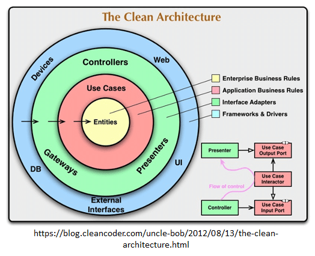

# Diseño de Arquitectura (Propuesta)

## Frontend

Es bien sabido que estos conceptos de arquitectura por lo general siempre se aplican para proyectos basados en tecnologias Backend, pero que hay sobre el Frontend ? acaso no es posible realizar buenas implementaciones de arquitectura sobre frameworks como Angular ? bueno veamoslo ...

## Propuesta

### Conceptos Principales

- Programación Orientada a Objetos
- Principios de Diseño
- Patrones de Diseño

Estos conceptos, paradigmas y patrones son fundamentales en el entendimiento general para una buena arquitectura de software, pero en si que es Arquitectura de Software.

 > Una arquitectura de [software], también denominada arquitectura [lógica], consiste en un conjunto de patrones y abstracciones coherentes que proporcionan un marco definido y claro para interactuar con el código fuente del software. - Wikipedia

 Esta es una definición generica que podemos encontrar en muchos libros y articulos, pero la arquitectura en lo personal y en el ambito del desarrollo de software es **El mayor valor**

 ## Entendamos la Arquitectura

 En el desarrollo de software nos encontramos con toda clase de retos y diferentes soluciones a esos retos, cada pieza de software que se construye se construye pensando en que funcione y que genere ganancias rapidamente. Pero es ese el camino ? correr como liebres apresuradamente escribiendo código lo más rapido posible, bueno prefiero ser la tortuga, la liebre es arrogante y lo va a lamentar.

 ## Sentando las bases

 No podemos hablar de arquitectura sin conocer los fundamentos sobre los que se construyen. se deben entender y aplicar en cada linea de código que se defina.

 ## Hagamos una App Todo!

 Debemos entender la arquitectura desde lo más basico e ir escalando hacia lo más avanzado, como la aplico en una simple aplicación y luego llevar esto al siguiente nivel.

## Alto Nivel

```typescript
// Entitie
interface TodoData {
    task: string
    date: Date
    priority: priority
}

// Type
type priority = "high" | "medium" | "low";

// Design
interface Crud<T, K> {
    create(payload: T): boolean
    update(payload: T): boolean
    remove(id: number): boolean
}
```

## Caso de Uso
```typescript
interface TodoUseCase extends Crud<TodoData, any> {
    readById(id: number): Array<TodoData>;
}
```

## Detalles de Implementación

```typescript
class Todo implements TodoUseCase {

    create(payload: TodoData): boolean {
        return true
    }

    update(payload: TodoData): boolean {
        return true
    }

    readById(id: number): TodoData[] {
        return [];
    }

    remove(id: number): boolean {
        return true;
    }
}
```

## UI
```typescript
// Model
abstract class ViewOutputLogic {
    form: any
    isLoading: boolean = false;
}

interface ViewInputLogic {
    setView(view: any): void
    createTodoAction(): void
    success(response: boolean): boolean
}

interface ViewInteractorLogic {
    setPresenter(presenter: any): void
    processAction(): boolean
}

// Interactor
class ComponentInteractor implements ViewInteractorLogic {
    private _todoUseCase!: TodoMySQLUseCase;
    private _presenter!: ViewInputLogic;

    constructor(todoUseCase: TodoMySQLUseCase) {
        this._todoUseCase = todoUseCase;
    }

    setPresenter(presenter: ViewInputLogic): void {
        this._presenter = presenter;
    }

    processAction(): boolean {
        let task: TodoData = {
            task: "Do my homework",
            date: new Date(),
            priority: "low"
        }

        return this._presenter.success(this._todoUseCase.create(task));
    }
}

// Presenter
class ComponentPresenter implements ViewInputLogic {
    private _view!: ViewOutputLogic;
    private _interactor!: ViewInteractorLogic

    constructor() {
        this._interactor.setPresenter(this);
    }

    setView(view: ViewOutputLogic): void {
        this._view = view;
    }

    createTodoAction(): void {
        this._interactor.processAction();
    }

    success(response: boolean): boolean {
        this._view.isLoading = response;
        return response;
    }
}

// View
class ComponentView extends ViewOutputLogic {
    private _presenter!: ViewInputLogic

    constructor() {
        super();
        this._presenter.setView(this);
    }

    titleApp(): void {

    }

    showMenu(): void {

    }

    chooseOptionMenu(id: string): void {

    }

    createTodoAction(): void {
        this._presenter.createTodoAction();
    }
}
```

## Bajo Nivel
```typescript
// Module
class Application {
    private _view!: ComponentView;

    constructor(view: ComponentView) {
        this._view = view;
    }

    start(): void {
        this._view.titleApp();
    }
}

//concreción - low level system
const app = new Application(
    new ComponentView()
);
```

Se busca con esta propuesta mejorar la escalablidad y mantenibilidad del proyecto usando el patron Clean Architecture y en la capa UI MVVM.

## Patron a seguir


## Esquema de Directorio

### Domain
<sub>Reglas de negocio</sub>

La politica de mas alto nivel compuesto, por Entidades, Interfaces y Casos de uso si es necesario.

### Application
<sub>Gstion de datos</sub>

Donde realizaremos la gestion de la data a consumir basandonos en los detalles de especificacion de cada servicio

### UI
<sub>Presentacion</sub>

Definicion de las vistas la capa mas alejada del negocio, la composicion de cada vista estara definida de la siguiente formato:

- Interactor
    - Capa que gestiona el negocio donde se inyectan las dependencias necesarias.
- Presenter
    - Capa que realiza la transformacion de los datos de acuerdo a lo entregado por el interactor para ser luego entregado a la vista.
- View
    - Presentacion de los datos, captura de eventos por parte del usuario control de flujo inicial.

# SOLID

Los buenos sistemas de software comienzan con un buen codigo. Los principios SOLID nos ayudaran a ordenar nuestras estructuras de datos y como estas deben interconectarse.

# Ejemplo Directorio

* app
    * analytics
    * application
        * services
        * usecases
        * providers
    * network
        * requests
        * responses
    * domain
        * entities
        * interfaces
    * common
        * utils
        * helpers
        * errors
    * core
        * directives
        * guards
        * constants
        * forms
        * pipes
        * validators
    * shared
        * UIComponents
    * ui
        * auth
            * interactor
            * presenter
            * view
                * model
                    * auth.model.ts
              auth.component.html
              auth.component.ts
        * auth.module.ts
        * auth.routing.ts

#

## Ejemplo de Codigo

Ejemplo de Vista
```typescript
@Component({
  selector: 'app-login',
  templateUrl: './login.component.html'
})
export class LoginComponent extends LoginOutputLogic implements OnInit, OnDestroy  {

  constructor(
    @Inject('loginPresenterProvider') private _presenter: LoginInputLogic,
    private formBuilder: FormBuilder
  ) {
    super()
    this._presenter.setView(this)
  }

  get username() {
    return this.authForm.get('username');
  }

  get password() {
    return this.authForm.get('password');
  }

  ngOnInit() {
    this.buildForm();
  }

  buildForm() {
    this.authForm = this.formBuilder.group(AuthFormFields);
  }

  login() {
    this._presenter.login(this.authForm);
  }

  ngOnDestroy(): void {

  }
}
```

Model
```typescript

export abstract class OutputLogic {
  authForm: FormGroup;
  noNavigate: boolean;
  errorAuthentication: HttpErrorResponse;
  isLoading: boolean;
  authenticationResponse: HttpResponse<AuthResponse>;
}

export interface InputLogic {

}

export interface InteractorLogic {

}

```

Ejemplo de Presenter
```typescript
@Injectable()
export class LoginPresenter implements LoginInputLogic {
  private _view: LoginOutputLogic;

  constructor(private _interactor: LoginInteractor) {
    this._interactor.setPresenter(this);
  }

  public setView(component: LoginOutputLogic): void {
    this._view = component;
    this._interactor.setView(component);
  }

  login(formLogin: FormGroup): void {
    this._interactor.login(formLogin);
  }
}
```

Ejemplo de Interactor
```typescript
@Injectable()
export class LoginInteractor implements LoginInputLogic {

  private _presenter: LoginInputLogic;
  private _view: LoginOutputLogic;

  constructor(
    private router: Router,
    @Inject('authProvider') private authService: IAuthRepository,
    @Inject('localStorageProvider') private localstorageService: ILocalStorageRepository
  ) { }

  setPresenter(presenter: LoginInputLogic): void {
    this._presenter = presenter;
  }

  setView(view: LoginOutputLogic): void {
    this._view = view;
  }

  login(formLogin: FormGroup): void {
    
  }

  private validateResponseAuthentication(response: HttpResponse<AuthResponse>): void {
    
  }

  private redirectAndSaveSession(response: HttpResponse<AuthResponse>): void {
    
  }
}
```

# Inversion de Dependencia

Es importante establecer mecanismos que nos permitan no depender de los detalles de implementacion que pueden cambiar con el tiempo, uno de estos usando el principio de diseno **DIP**

Este principio nos dice que debemos depender de abstracciones mas no de concreciones.

Ejemplo de Codigo

abstraccion

```typescript
export interface IAuthRepository {
  authentication(payload: AuthRequest): Observable<HttpResponse<AuthResponse>>
}
```

Concrecion
```typescript
@Injectable()
export class AuthService implements IAuthRepository {

  constructor(private http: HttpClient) { }

  authentication(payload: AuthRequest): Observable<HttpResponse<AuthResponse>> {
    return this.http.post<AuthResponse>(`${environment.API}/api/SignIn`, payload, { observe: 'response' });
  }
}
```

DIP
```typescript
// Invertimos la dependencia de nuestro servicio hacia nuestra abstracion
constructor(
    @Inject('authProvider') private authService: IAuthRepository
  ) { }
```
